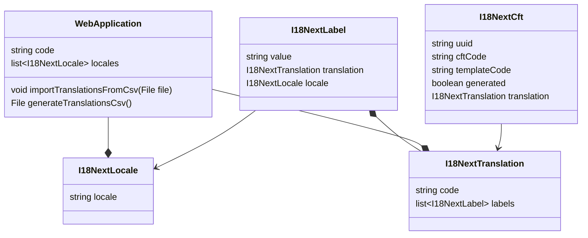

# Internationalization

## Class diagram

## Methods description

*generateTranslationsCsv* :

1/ For each CFT of the related module, create (only if the corresponding `I18NextCft` does not exist)
- a `I18NextLabel` instance for each locale and with value = the cft description
- a `I18NextTranslation` that has code = {templateCode}.{cftCode}, generated = `true` and that references the previous `I18NextLabel`
- a  `I18NextCft` that has cftCode = cft.code, templateCode=cft.appliesTo, and that references the previous `I18NextTranslation`

2/ Remove every generated `I18NextTranslation` that are not referenced by an `I18NextCft`

3/ Determine the columns of the CSV
- always the "code" column
- one column per locale of the `WebApplication`

4/ Write the CSV : iterate over all the `I18NextTranslation` and fill the columns of the CSV
