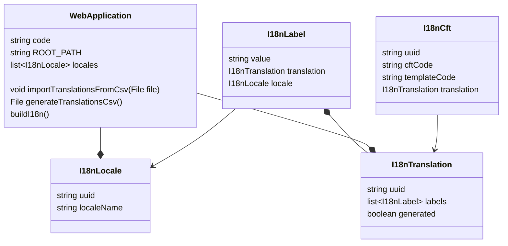

# Internationalization

## Class diagram

## Methods description

### generateTranslationsCsv

1/ For each CFT of the related module, create (only if the corresponding `I18nCft` does not exist)
- a `I18nLabel` instance for each locale and with value = the cft description
- a `I18nTranslation` that has code = {templateCode}.{cftCode}, generated = `true` and that references the previous `I18nLabel`
- a  `I18nCft` that has cftCode = cft.code, templateCode=cft.appliesTo, and that references the previous `I18nTranslation`
- add each of the generated CEIs to the related module

2/ Delete every generated `I18nTranslation` that are not referenced by an `I18nCft`

3/ Determine the columns of the CSV
- always the "code" column
- one column per locale of the `WebApplication`

4/ Write the CSV with the name "translations.csv" on the root of current git repository : iterate over all the `I18nTranslation` and fill the columns of the CSV. The column headers should be included in the CSV.

### importTranslationsFromCsv

**For each line of the CSV :** 

1/ Retrieve or create the `I18nTranslation` that corresponds to the first row

2/ For each remaining column, create or update the corresponding `I18nLabel`

3/ Add everything to the related module

3/ Delete all `I18nTranslation` that are not mentionned in the CSV file

### buildI18n

1/ Convert the data-model to XLIFF format (https://lit.dev/docs/localization/overview/#translation-with-xliff) : create / overwrite one file per locale, put them under /{ROOT_PATH}/locales/{localeUuid}

2/ Run `npm lit-localize build` from /{ROOT_PATH}
